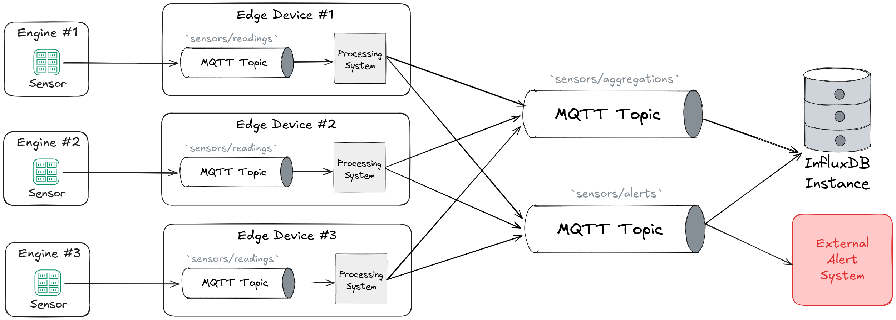

# Uma Proposta de Arquitetura de Dados para Processamento de Eventos Críticos

Sistemas de processamento de dados em nuvem, embora escaláveis, são inerentemente limitados pela latência do round-trip,
o que os torna inadequados para cenários que exigem detecção de anomalias local e ágil. Para sistemas críticos, a 
decisão deve ocorrer em milissegundos, diretamente na borda.

O desafio central é mover essa inteligência de processamento para dispositivos de hardware com recursos computacionais
severamente limitados, como um Raspberry Pi 4 (1 vCPU e 2GB de RAM). Executar algoritmos de agregação, detecção e correlação de métricas com baixa latência e consistência nesse tipo de hardware é um problema técnico complexo.

Este trabalho visa investigar e demonstrar como arquiteturas baseadas em tecnologias de streaming de código aberto 
podem ser otimizadas para realizar esse processamento distribuído diretamente na borda, mesmo em cenários com centenas 
de métricas por segundo, múltiplos fluxos concorrentes e requisitos rigorosos de coordenação temporal.



# Como executar

- Inicie os containers Docker, no modo _detached_.
```sh
docker-compose up -d
```

- Execute o script gerador de eventos.
```sh
docker exec -it datagen python datagen/app.py
```

- Execute o script que processa os eventos.
```sh
docker exec -it processing python processing/app.py
```

- (Opcional) Inicie o serviço `observer` para monitoramento dos containers (CPU, uso de memória e I/O)
```sh
docker exec -it observer python o11y/app.py
```

# Testes e Validação da Arquitetura
Para validar a robustez e a eficiência da arquitetura proposta, foram desenvolvidos dois conjuntos de testes distintos, 
cada um focado em um aspecto crítico do sistema: a velocidade de resposta a eventos críticos (Hot Path) e a estabilidade
do pipeline de dados históricos (Cold Path).

## Teste 1: Latência de Alerta Fim-a-Fim (Hot Path)

Este teste mede a eficiência do "caminho quente" da arquitetura. O objetivo é calcular o tempo exato, em milissegundos, entre o momento em que um evento anômalo é **gerado** pelo sensor e o momento em que ele é **processado e salvo** como um alerta no banco de dados.

### Processo de Análise
1. **Iniciar o setup do experimento:** Iniciar os container de processamento, o broker MQTT e o script de observabilidade de métricas.
    ```bash
    docker-compose up -d observer processing mqtt-broker
    ```

2. **Iniciar os demais containers:** Os constainers para geração de eventos e gerenciamento da simulação são iniciados.
    ```bash
    docker-compose up -d simulation datagen
    ```

3. **Executar o script de simulação:** Deixe o sistema rodar por alguns minutos. O orquestrador (`simulation/app.py`) irá reiniciar automaticamente o `datagen` toda vez que um alerta for detectado, criando múltiplos ciclos de "falha" para a coleta de dados.
    ```bash
    docker exec -it simulation python simulation/app.py
    ```    

4. **Execute a Análise SQL:** Conecte-se ao contêiner do banco de dados `metrics-db` (PostgreSQL) e execute o script SQL abaixo. Este script compara o timestamp do evento original com o timestamp do *primeiro alerta* correspondente em cada ciclo de simulação.

    ```sql
    WITH base_alerts AS (
        -- Seleciona os alertas e cria um "ID de Simulação" (baseado na hora/minuto)
        SELECT
           event_id,
           timestamp,
           CONCAT(EXTRACT(HOUR FROM "timestamp"), EXTRACT(MINUTE FROM "timestamp")) AS simulation_id
        FROM alerts
        WHERE type = 'overheating' -- Filtra pelo tipo de alerta desejado
    ),
    
    ranked_alerts AS (
        -- Identifica o PRIMEIRO alerta de cada ciclo de simulação
        SELECT
           *,
           rank() OVER (PARTITION BY simulation_id ORDER BY timestamp ASC) AS rank
        FROM base_alerts
    )
    
    -- Calcula a diferença de tempo (latência)
    SELECT
        ra.event_id,
        ra."timestamp" AS alert_timestamp,
        a."timestamp" AS event_timestamp,
        ra."timestamp" - a."timestamp" AS difference
    FROM ranked_alerts ra
    INNER JOIN events a
       ON ra.event_id = a.event_id
    WHERE ra.rank = 1; -- Filtra apenas pelo primeiro alerta de cada ciclo
    ```

#### Análise do Resultado

A coluna `difference` no resultado da query mostrará a latência fim-a-fim para cada ciclo de simulação. Ao analisar a média e a distribuição desses valores, é possível validar a performance da arquitetura para responder a eventos críticos.

## Teste 2: Análise de Regularidade do Pipeline de Dados (Cold Path) 
Este teste avalia a estabilidade e a previsibilidade do pipeline de agregação de dados ("cold path"). O objetivo é
validar quantitativamente que os dados chegam ao InfluxDB em intervalos consistentes e previsíveis, conforme o esperado
(10.000 milissegundos).

A análise mede a distribuição dos intervalos de tempo entre cada registro, com precisão de milissegundos, permitindo
calcular a média e o desvio padrão para provar a estabilidade do sistema e medir sua "tremulação" (jitter).
```
from(bucket: "sensor_data")
  |> range(start: -30m)
  |> filter(fn: (r) => r._measurement == "mqtt_consumer")
  |> pivot(
      rowKey:["_time"],
      columnKey: ["_field"],
      valueColumn: "_value"
     )
  |> sort(columns: ["_time"])
  |> elapsed(unit: 1ms)
  |> keep(columns: ["_time", "elapsed"])
```
